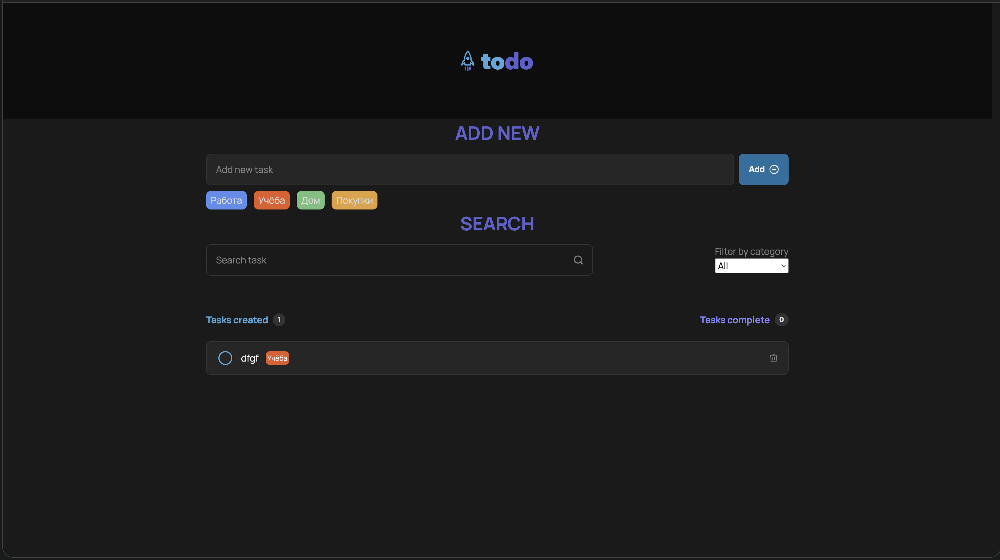

# ToDo App

Простое приложение для управления задачами с категориями и фильтрацией.

## Функции
- Добавление/удаление задач
- Категории с цветовой маркировкой
- Поиск и фильтрация
- Сохранение в LocalStorage

## Технологии
- Vanilla JavaScript (ES6+)
- CSS Grid/Flexbox
- LocalStorage API

## Установка
1. Склонируй репозиторий
2. Открой `index.html` в браузере

## Чему научился
- Работа с классами и модулями
- Управление состоянием приложения
- Делегирование событий
- Нормализация данных

## Демо
[Перейти на gitPage](https://r-nikolaev.github.io/todo-list/)

